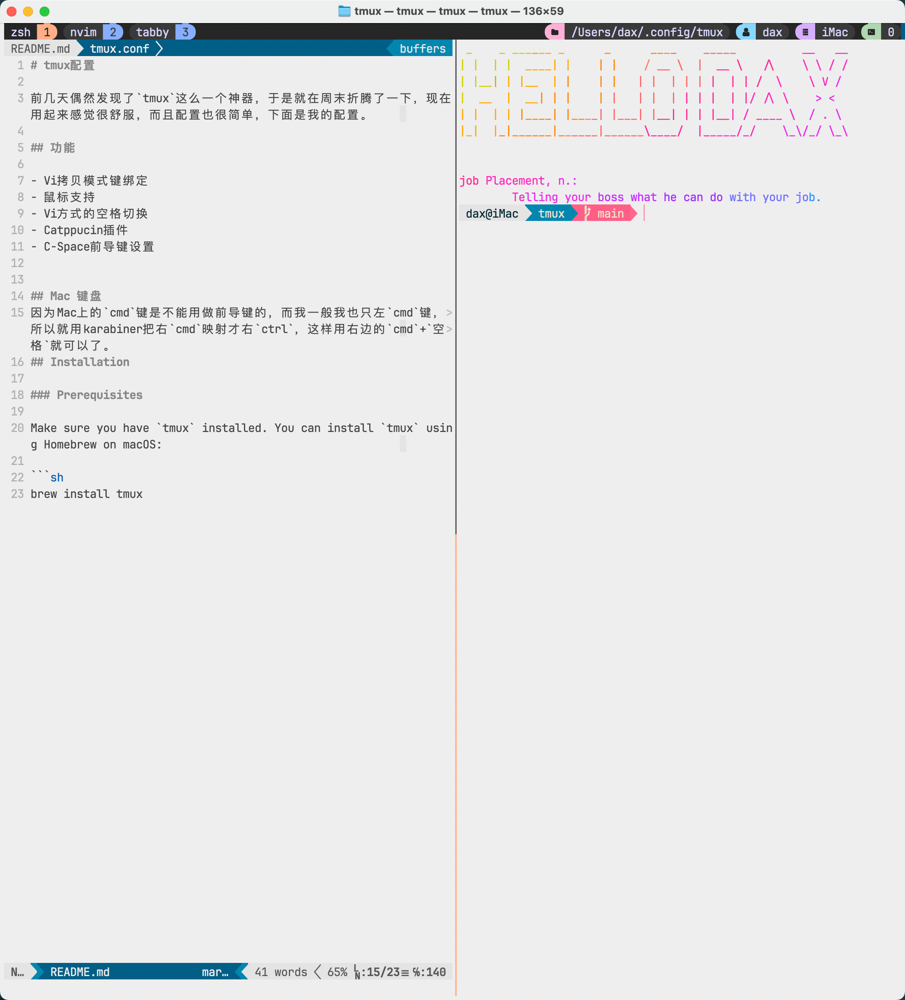

# tmux配置

前几天偶然发现了`tmux`这么一个神器，于是就在周末折腾了一下，现在用起来感觉很舒服，而且配置也很简单，下面是我的配置。


## 功能
- 前导键 r重载配置文件
- 拷贝模式vi风格键绑定
- 鼠标支持
- 窗格切换的vi风格键绑定
- Catppucin插件
- C-Space前导键设置
- 状态栏放在上面
- 窗口号码从1开始


## Mac 键盘与前导键
一般的设置都是用的`ctrl`键，而我的Mac键盘上只有一个左`ctrl`键。`ctrl+space`系统用于启动spotlight搜索框，我用`alfred`所以这个用不上。Mac上的`cmd`键是不能用做前导键的，而我一般我也只左`cmd`键，所以就用karabiner把右`cmd`映射才右`ctrl`，这样用右边的`cmd`+`空格`就可以了。如果要用这个键组合做为前导键，记得要把系统里面spotlight的快捷键去掉。

## 状态栏放在上面的考量
如果放在下面的话，用Vim的时候下面就会显得很拥挤(有Vim的状态栏)。

## Installation
克隆本仓库到`~/.config/tmux`，如果不是macOS的话请搜索一下配置文件的地址。
```
git clone https://github.com/bestdax/tmux ~/.config/tmux
```
克隆tpm(tmux plugin manager)到`~/.config/tmux/plugins/tpm`

重载配置文件然后按前导键 I来安装其余的几个插件。
### Prerequisites

Make sure you have `tmux` installed. You can install `tmux` using Homebrew on macOS:

```sh
brew install tmux
